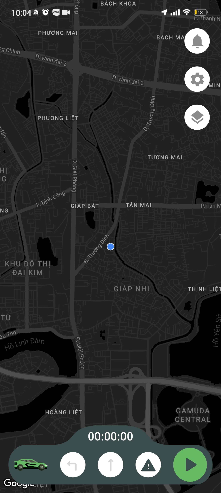

# GDSC_HUST_MOBILE

## Please recreate the app as closely as possible in the following video.

Click on the video to view details.

## Requirements:
 - Layout like in the video.
 - Stopwatch.
 - Press and hold a button for three seconds to activate the stopwatch.
 - A dialog box appears when the user presses the stop button to confirm if they want to stop: yes -> resume, no -> stop.

### You can use external packages for support and any programming language to make the app.(Recommend Flutter)
